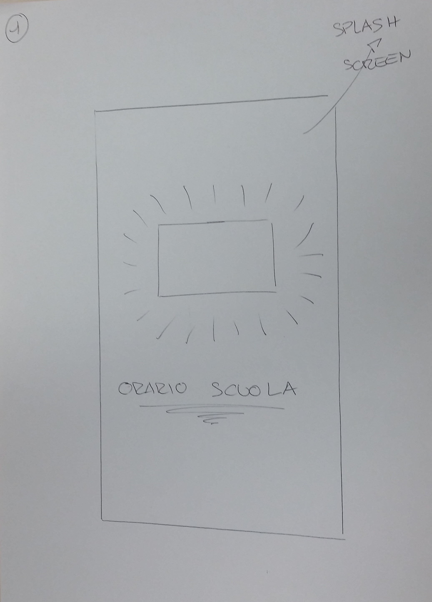
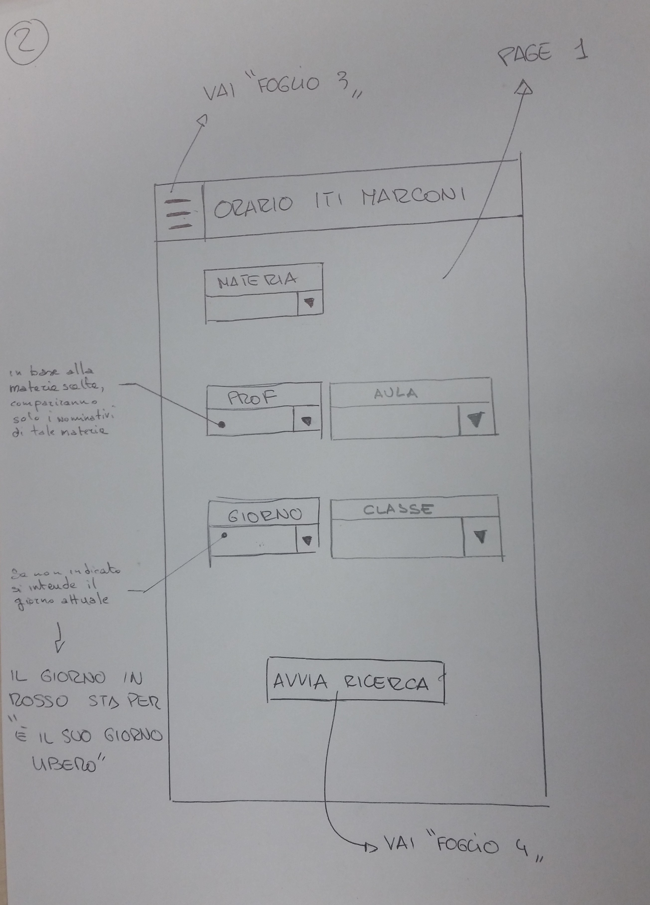
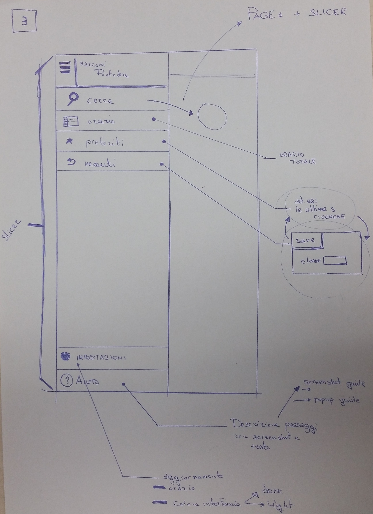
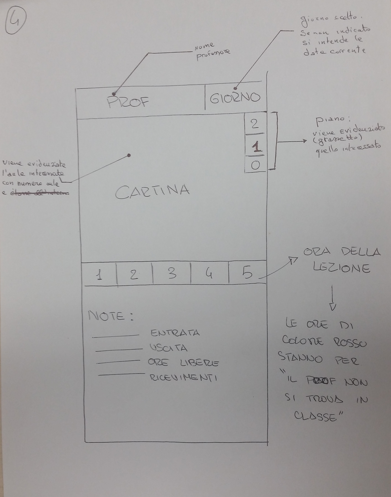

# ProgettoScuolaLavoro_GestioneOrario
Progetto Scuola Lavoro effettuato presso ISTI - CNR da Toni Jacopo e Becuzzi Filippo

App Orario Scuola - Liceo Marconi Pontedera tirocinio formativo 3ASA 06-16 Giugno 2016

Tirocinio Formativo presso il Laboratorio FMT dell'Istituto ISTI del CNR di Pisa

Questo Repository contiene:
 - il codice dell'applicazione Android 
per la ‘Gestione dell'orario dell'istituto’
 - semplice parser per la lettura del orario dell'istituto 

 - [Giornale Di Bordo](https://github.com/MARCONIPONTEDERA-ISTI/ProgettoScuolaLavoro_GestioneOrario/wiki/Giornale-di-Bordo): un elenco giornaliero delle attività svolte .

di seguito un esempio di mockup dell’applicazione:

